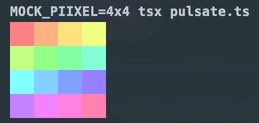

# 🚥 piixel

> Control WS281X LEDs from a Raspberry Pi using TypeScript / Node.js

This is a Node.js / [Node-API](https://nodejs.github.io/node-addon-examples/) wrapper around the [rpi-ws281x](https://github.com/jgarff/rpi_ws281x) library.

### Requirements

- Raspberry Pi (Tested on Raspberry Pi 4 Model B). NOTE: It will **NOT** work on Raspberry Pi 5, see: [jgarff/rpi_ws281x#528](https://github.com/jgarff/rpi_ws281x/issues/528) for details.
- A WS281X LED Strip, for example one of the many [Adafruit NeoPixels](https://www.adafruit.com/category/168)
- Node.js v18.x or later

### Installation

Note: This package will only work on a Raspberry Pi.

```sh
npm install piixel

# or if you prefer to install it system-wide
npm install -g piixel
```

### Usage

See [API documentation](./docs/index.md) and the [examples](./examples) directory.

# Minimal Example

This will light up all LEDs in different colors of the color wheel.

```typescript
// example.ts

import {colorwheel, StripType, ws281x} from 'piixel'

const LEDS = 16

// Configure the library. Must be called before calling `render`.
// See APIDocs for the full list of options
// https://github.com/bjoerge/pipixel/blob/main/docs/piixel.ws281xconfig.md
ws281x.configure({
  gpio: 18,
  leds: LEDS,
  type: StripType.WS2811_STRIP_GRB,
})

const pixels = new Uint32Array(LEDS)
for (let i = 0; i < LEDS; i++) {
  pixels[i] = colorwheel((i * 256) / LEDS)
}

// Render pixels to the LED strip
ws281x.render(pixels)

// Optionally, render with brightness
ws281x.render({pixels, brightness: 0.4})
```

Use ts-node or [tsx](https://github.com/privatenumber/tsx) to run

```sh
tsx ./example.ts
```

Note: Depending on which GPIO pin you use, you might need to run the script with `sudo`. See the README of [rpi-ws281x](https://github.com/jgarff/rpi_ws281x?tab=readme-ov-file) for more information.

### Development

Since this library only works on a Raspberry Pi, development on other platforms becomes a bit cumbersome.
To make it easier to develop on your local machine, there's a `MOCK_PIIXEL` environment variable that can be set that will mock the hardware module and instead allow you to (optionally) render pixels to the terminal.


The environment variable can be set to the following values:
- `1` - Enables terminal rendering, and renders all pixels in a single row.
- `-1` – Enables mocking, but turns off terminal rendering.
- `n` - Distributes pixels across n rows.
- `HxW` - Renders pixels in an HxW grid. Any pixel outside the HxW grid will be ignored.

Examples:

- `MOCK_PIIXEL=1 tsx ./my-example.ts` - Renders all pixels in a single row.
- `MOCK_PIIXEL=8 tsx ./my-example.ts` - Distributes pixels in an 8xN grid.
- `MOCK_PIIXEL=8x8 tsx ./my-example.ts` - Renders pixels in an 8x8 square. Any pixel outside the 8x8 grid will be ignored.
- `MOCK_PIIXEL=-1 tsx ./my-example.ts` - Mock the hardware module, but don't render anything to the terminal.


### Credits

- Thanks to Jeremy Garff for writing and maintaining the [rpi-ws281x](https://github.com/jgarff/rpi_ws281x) C library.

- This project has taken a lot of inspiration from [meg768/rpi-ws281x](https://github.com/meg768/rpi-ws281x). It originally started as an attempt to make it work on a Raspberry Pi 4b, but I kept running into issues with random memory corruptions, so figured I'd instead write something from scratch using the [Node-API](https://nodejs.github.io/node-addon-examples/), which is more stable and future-proof than the legacy Native Abstractions for Node.js (NAN) used in that module. After the rewrite, the memory corruptions were gone.

### License

MIT
